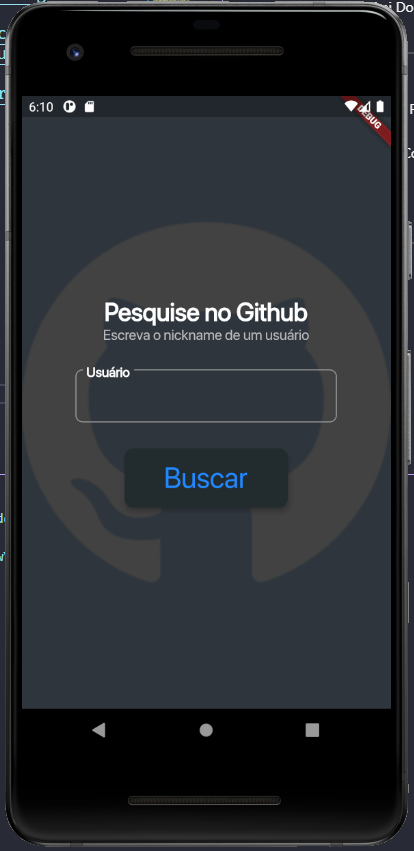
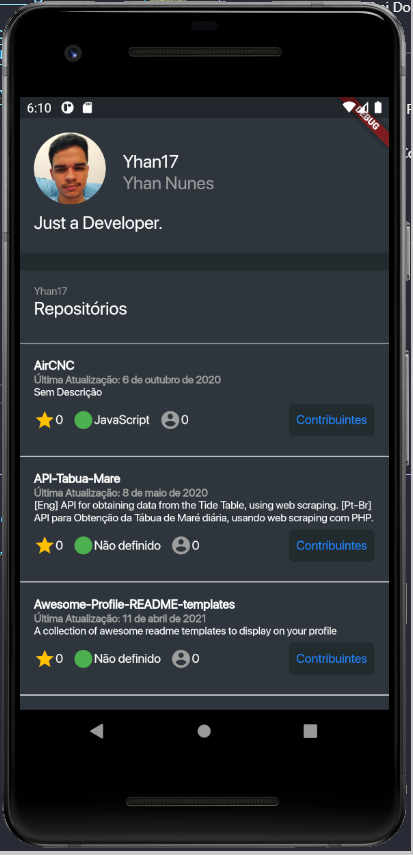
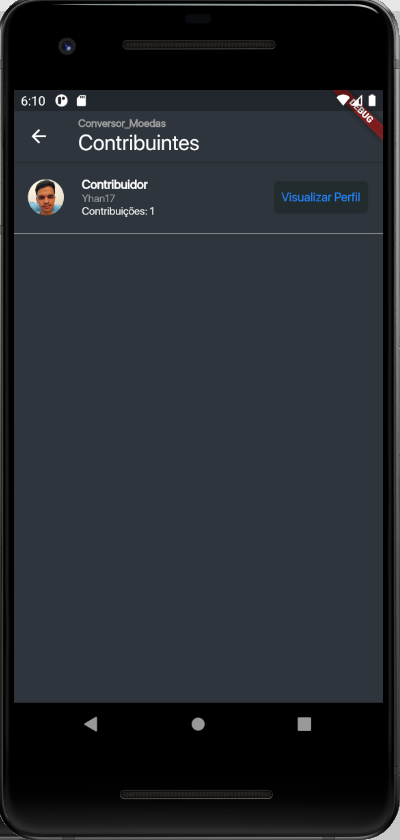

# Desafio Aplicativo de Requisições Api Github 

## Sobre o App

O objetivo deste aplicativo é realizar buscas na api pública do github , onde será exibido o perfil do usuário com sua <strong>Foto de Perfil</strong>, <strong>Nome</strong>, <strong>Nome de Usuário</strong> e sua <strong>Lista de Repositórios</strong>. Ao exibir a Lista de Repositórios do usuário, são listadas as seguintes informações: <strong>Nome do repositório</strong>, <strong>Data da última atualização (Formatada para o padrão brasileiro)</strong>, <strong>Quantidade de Estrelas do Repositório</strong>, <strong>Linguagem Utilizada</strong>, <strong>Quantidade de Forks</strong>, <strong>Descrição do Repositório</strong> e <strong>Lista de Contribuidores</strong>. A lista de contribuidores apresenta <strong>Números de Contribuições</strong>, <strong>Nome de Usuário e Foto de Perfil.</strong>

--- 
## Aspectos Técnicos

- Architecture: [Clean Architecture](https://resocoder.com/category/tutorials/flutter/tdd-clean-architecture/)
- State Management: [Riverpod, StateNotifier](https://pub.dev/packages/flutter_riverpod)
- Tests: [TDD](https://github.com/ResoCoder/flutter-tdd-clean-architecture-course)
- Github Commit System: [Gist](https://gist.github.com/parmentf/035de27d6ed1dce0b36a)
- Github Api: [Api](https://docs.github.com/pt/rest)
- Postman Api Doc: [Postman](https://documenter.getpostman.com/view/10877638/TzecD5Q1)
- CI: [CI FLutter](https://github.com/marketplace/actions/flutter-action)
---
## Requisitos

- [x] Search User Page
- [x] User Profile
- [x] Repository Contributors Page
- [x] Riverpod
- [x] Http
- [x] Github Api

---
## Telas

